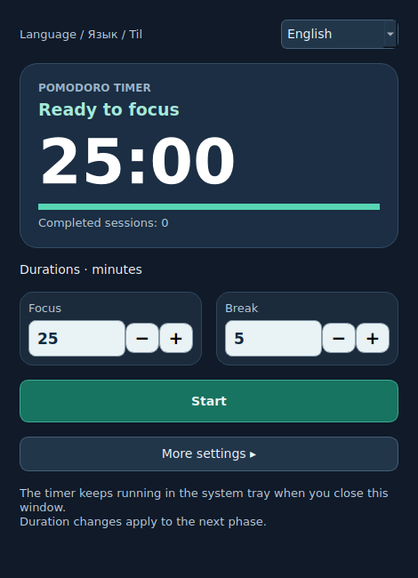

# Pomodoro Time Manager

**EN:** A focus and time-management timer: work for 25 minutes, rest for 5, and repeat. Full-screen breaks, gentle sounds, and system-tray controls help you follow your schedule.

**UZ:** Diqqat va vaqtni boshqarish taymeri: 25 daqiqa ishlang, 5 daqiqa dam oling va takrorlang. To‘liq ekran tanaffusi, qisqa ovozlar va panel boshqaruvi jadvalga amal qilishga yordam beradi.

**RU:** Таймер для концентрации и управления временем: 25 минут работы, 5 минут отдыха и новый цикл. Полноэкранный перерыв, звуки и управление из системного трея.



## Download / Yuklab olish / Скачать

| Platform | Package | Instructions |
| --- | --- | --- |
| Windows x64 | `Pomodoro-Windows-x64.zip` | [Windows](platforms/windows/README.md) |
| Linux x64 | `Pomodoro-Linux-x64.tar.gz` | [Linux](platforms/linux/README.md) |

Download the matching file from **Releases** after a release build succeeds. Development builds are available in **Actions → Desktop builds → Artifacts**. Packages are built separately on their target operating systems.

Mos paketni **Releases** bo‘limidan oling. Ishlab chiqish paketlari **Actions → Desktop builds → Artifacts** ichida. Windows va Linux alohida yig‘iladi.

Скачайте пакет для своей системы в **Releases**. Сборки для разработки находятся в **Actions → Desktop builds → Artifacts**.

## Languages / Tillar / Языки

Choose **English**, **Русский**, or **O‘zbekcha** at the top of the desktop window. The choice is saved; changing it does not reset the timer. The menu, break screen, sounds setting and notifications use the chosen language.

Oynaning yuqorisidan tilni tanlang. Tanlov saqlanadi, taymer qaytadan boshlanmaydi.

Выберите язык в верхней части окна. Выбор сохраняется без сброса таймера.

## Features

- Adjustable focus and break lengths; optional long breaks after several sessions.
- Start, pause, resume, stop, skip a break, or add one minute.
- Full-screen break windows on connected monitors; **Esc** returns to focus.
- A warning 30 seconds before the break; optional start/end sounds.
- Saved session and durations; one running Qt instance per user.
- Consistent +/− controls, keyboard focus and a scrollable settings window.

The Windows/Linux Qt package shows remaining time in the tray tooltip and menu. Ubuntu GNOME 46 users can alternatively install the native extension for timer text directly in the top panel. That optional native interface currently remains in Uzbek; see [GNOME guide](docs/GNOME-UZ.md). Run one variant at a time.

## Development

Python 3.12:

```sh
python -m venv .venv
# Windows: .venv\Scripts\activate
# Linux: source .venv/bin/activate
python -m pip install -r requirements-desktop.txt
python desktop.py
```

```sh
python -m unittest discover -s tests -p desktop_test.py -v
node --test tests/timer.test.mjs
python -m pip install "pyinstaller>=6.11,<7"
python scripts/build_desktop.py
```

[Detailed platform behavior and build notes](docs/DESKTOP.md).

- `desktop.py` — common Windows/Linux interface.
- `translations.py` — English, Russian and Uzbek text.
- `timer_core.py` — shared Python session model.
- `control.py`, `indicator.py`, `extension.js`, `timer.mjs` — optional Ubuntu GNOME integration.
- `platforms/` — separate platform instructions.
- `.github/workflows/desktop.yml` — tests, platform builds, and tagged releases.

## Verification status

Linux source and packaged startup have been tested locally. Automated tests cover timer transitions, pause/resume, persistence, language changes, buttons and escaping the break screen. A Windows build must pass Windows CI; tray, audio, display scaling and multiple physical monitors still need a Windows machine for hands-on verification.

This repository does not include a code-signing certificate. Build artifacts are unsigned.
