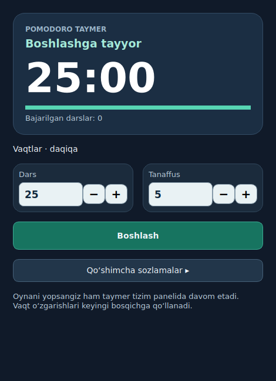

# Pomodoro Ubuntu



Ubuntu 24.04 / GNOME Shell 46 uchun soat yonida ishlaydigan Pomodoro taymeri.
Tanaffus ekranida `black-hole.jpg` rasmi fon sifatida ishlatiladi.
Darsni boshqarish oynasida katta taymer, jarayon chizig‘i, yonma-yon vaqt tanlash
kartochkalari va holatga mos bitta asosiy tugma bor.
Tanaffus boshlanishi va tugashida tizimning qisqa bildirishnoma ovozlari chalinadi.
Tanaffusdan 30 soniya oldin bildirishnoma chiqadi. Tanaffusda Esc darsga qaytaradi,
`+1 daqiqa` tugmasi damni uzaytiradi. Ovoz, ixtiyoriy uzun tanaffus va ekran
qulflanganda pauza «Qo‘shimcha sozlamalar» ichida boshqariladi.

## O‘rnatish

```bash
./install.sh
```

Administrator huquqi kerak emas. GNOME Wayland yangi kengaytmani darhol yuklamasa,
sessiyadan chiqib, qayta kiring; kengaytma avtomatik yoqiladi.
O‘rnatish Desktop va ilovalar menyusiga ikki marta bosib ochiladigan
**Pomodoro Ubuntu** yorlig‘ini ham qo‘shadi. Boshqaruv oynasidagi va yuqori
paneldagi taymer bitta sessiyani ko‘rsatadi.
Joriy Wayland sessiyasida GNOME kengaytmasi hali yuklanmagan bo‘lsa, boshqaruv
oynasi ishga tushganda Ubuntu AppIndicators orqali panelda vaqt ko‘rsatadi.
Kengaytma faollashganda GTK indikatori avtomatik yopiladi va vaqtni kengaytma
boshqaradi.
**Boshlash** bosilgach boshqaruv oynasi yashirinadi; paneldagi belgini ikki marta
bosish yoki Desktop yorlig‘ini qayta ochish oynani ko‘rsatadi.
Desktopdagi `Pomodoro Ubuntu - Hisobot.html` faylida loyiha haqida batafsil
texnik hisobot bor.

## Foydalanish

1. Soat yonidagi taymerni bosing.
2. O‘qish va tanaffus daqiqalarini `−` va `+` bilan belgilang (odatiy 25/5).
3. **Boshlash** ni bosing. O‘qish vaqti panelda ko‘rinadi.
4. Vaqt tugagach, to‘liq ekran tanaffus taymeri ochiladi. Tanaffus tugaganda
   u avtomatik yopilib, yangi o‘qish vaqti boshlanadi.

Pauza, davom ettirish, tanaffusni o‘tkazish va to‘xtatish mumkin. Belgilangan
vaqtlar hamda joriy sessiya saqlanadi; ekran qulflangandan so‘ng taymer yana
tegishli holatda davom etadi. Daqiqalarni ish jarayonida o‘zgartirish keyingi
bosqichdan boshlab amal qiladi.

## O‘chirish

```bash
gnome-extensions disable pomodoro-ubuntu@chainjas.local
gnome-extensions uninstall pomodoro-ubuntu@chainjas.local
```

## Windows va boshqa Linux ish stollari

`desktop.py` — PySide6 asosidagi umumiy versiya. Windows’da `.exe`, Linux’da esa
mustaqil paket sifatida yig‘iladi. Ikkalasida bir xil boshqaruv, +/− tugmalari,
tizim paneli menyusi, ovoz va ko‘p monitorli tanaffus mavjud.

[Ishga tushirish, paket yig‘ish va platformalar farqi](DESKTOP.md).
GitHub Actions konfiguratsiyasi Windows va Linux paketlarini alohida yig‘adi.
Git repozitoriysi ildizi sifatida shu papka ichidagilarni yuklang. `.gitignore`
vaqtinchalik fayllar, tayyor paketlar va shaxsiy mahalliy hisobotlarni chiqarib tashlaydi.

### Loyiha tuzilishi

- `control.py`, `indicator.py` — Ubuntu GTK oynasi va AppIndicators.
- `extension.js`, `timer.mjs` — GNOME paneli va JavaScript taymeri.
- `desktop.py` — Windows/Linux Qt oynasi.
- `timer_core.py` — Python interfeyslari uchun umumiy sessiya mantiqi.
- `scripts/` — distributiv yig‘ish va foydalanuvchi hisobiga o‘rnatish.
- `tests/` — vaqt almashinuvi va interfeys boshqaruvlari sinovlari.
